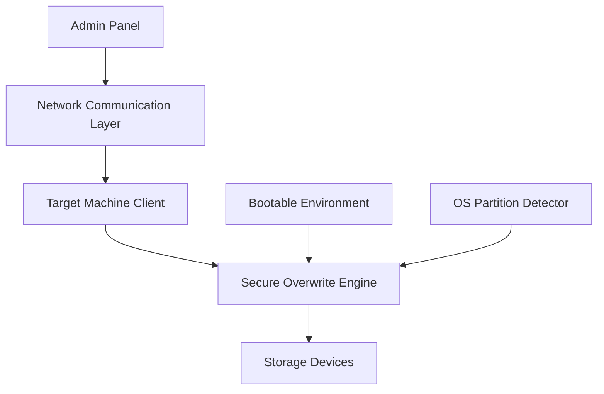

# System Architecture

## Overview
The Real Data Destruction System consists of multiple interconnected components that work together to provide secure data destruction while preserving the OS.

## Component Diagram



## Core Components

### 1. Admin Control Panel
- Web-based interface for managing remote wipes
- Device registration and monitoring
- Wipe method selection (1/3/7 pass)
- Progress tracking and log viewing
- Results reporting

### 2. Target Machine Client
- Runs on each target machine to be wiped
- Listens for wipe commands from admin panel
- Handles local execution of wipe process
- Reports status back to admin panel
- Manages reboot into bootable environment

### 3. Bootable Environment
- Standalone Linux-based system on USB/ISO
- Contains all necessary wipe tools
- Automatically detects and protects OS partitions
- Provides multiple wipe methods
- Verifies wipe completion

### 4. Secure Overwrite Engine
- Implements multiple overwrite algorithms
- Supports 1-pass, 3-pass, and 7-pass wiping
- Random data generation
- Zero-fill capabilities
- Verification after each pass

### 5. OS Partition Detection & Protection
- Identifies OS partitions using filesystem signatures
- Prevents any writes to OS partitions
- Protects boot sector and system files
- Maintains machine bootability

### 6. Network Communication Layer
- Secure communication between admin panel and clients
- Command transmission
- Status reporting
- Encrypted data transfer
- Works only within controlled network environment

## Data Flow

1. Admin initiates wipe through web interface
2. Command sent through network layer to target client
3. Client prepares system for wipe (backup configs, etc.)
4. Client reboots machine into bootable environment
5. Bootable environment loads and detects storage devices
6. OS partition detection runs to identify protected areas
7. Secure overwrite engine begins wiping non-OS partitions
8. Progress reported back through network layer to admin panel
9. Verification runs after wipe completion
10. Final report sent to admin panel

## Security Considerations

- All network communications encrypted
- Authentication required for admin access
- Client registration and verification
- Wipe verification to ensure completeness
- Audit logging for compliance purposes
- Protection against unauthorized access

## Technology Stack

### Backend
- Node.js/Express for admin panel and client services
- SQLite for lightweight database storage
- Socket.io for real-time communication
- OpenSSL for encryption

### Bootable Environment
- Linux kernel (minimal distribution)
- Custom initramfs
- C/C++ utilities for low-level disk operations
- Bash scripts for orchestration

### Frontend
- React.js for admin panel UI
- WebSocket for real-time updates
- Bootstrap for responsive design

## File Structure
```
truewipe/
├── admin-panel/
│   ├── server.js
│   ├── public/
│   │   └── index.html
│   └── package.json
├── client/
│   ├── client.js
│   └── package.json
├── bootable/
│   ├── initramfs/
│   ├── kernel/
│   └── bootloader/
├── engine/
│   ├── overwrite.c
│   └── verify.c
└── docs/
    ├── ARCHITECTURE.md
    └── README.md
```